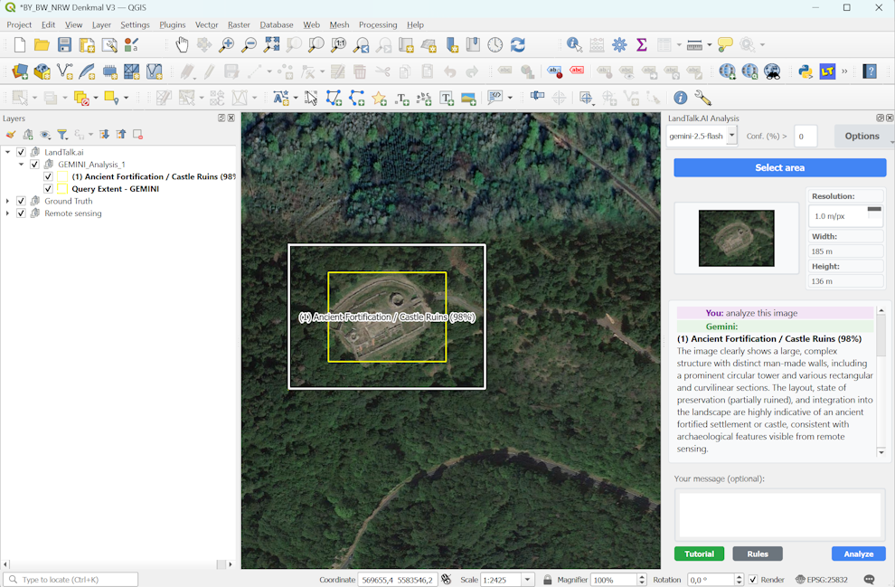

# LandTalk.ai - Your Landscape Talks With You 


 A QGIS plugin that allows users to analyze map areas using ChatGPT or Google's Gemini multimodal AI.

 This work is based on our research published in MDPI Geomatics 2025: "Visual Foundation Models for Archaeological Remote Sensing: A Zero-Shot Approach" by Juergen Landauer and Sarah Klassen (available at https://doi.org/10.3390/geomatics5040052))

## Workflow

 - IMPORTANT: read the tutorial! If you are NOT an archaeologist, you need to click the 'Rules' button and modify the text there according to your field of interest!
 - Select a rectangular area of your map
 - Capture the selected area as an image
 - Send the image along with a text prompt to Google Gemini or ChatGPT
 - View the AI analysis results

 ## Requirements

- QGIS 3.26 or later
- Google Gemini API key
- OpenAI GPT API key (optional, for GPT analysis)
- Python packages (install in QGIS Python environment):
  - `requests>=2.25.0` (for API calls)

## Network Configuration

The plugin automatically respects QGIS proxy settings configured in **Settings** > **Options** > **Network**. If you're behind a corporate firewall or using a proxy server, make sure to configure your proxy settings in QGIS before using the plugin.

## Installation

### Method 1: Install from QGIS Plugin Repository (Easiest)

1. Open QGIS
2. Go to **Plugins** > **Manage and Install Plugins**
3. Click on the **All** tab
4. In the search box, type "LandTalk.AI"
5. Find the LandTalk.AI plugin in the search results
6. Click **Install Plugin**
7. The plugin will be automatically downloaded, installed, and enabled

### Method 2: Install from ZIP file (Alternative)

1. Download the latest release ZIP file from the [releases page](https://github.com/juergenlandauer/LandTalk.AI/releases)
2. Open QGIS
3. Go to **Plugins** > **Manage and Install Plugins**
4. Click on the **Install from ZIP** tab
5. Browse and select the downloaded ZIP file
6. Click **Install Plugin**
7. The plugin will be automatically installed and enabled

### Method 3: Manual Installation

1. Download the plugin source code
2. Install required Python packages in your QGIS Python environment:
   ```bash
   # Using pip (adjust path to your QGIS Python installation)
   pip install requests>=2.25.0
   
   # Or install from requirements.txt
   pip install -r requirements.txt
   ```
3. Copy the `LandTalk` folder to your QGIS plugins directory:
   - Windows: `C:\Users\{username}\AppData\Roaming\QGIS\QGIS3\profiles\default\python\plugins`
   - Linux: `~/.local/share/QGIS/QGIS3/profiles/default/python/plugins`
   - macOS: `~/Library/Application Support/QGIS/QGIS3/profiles/default/python/plugins`
4. Restart QGIS and enable the plugin from Plugins > Manage and Install Plugins

 ## Usage


 1. Click the LandTalk.ai Image Analysis icon in the QGIS toolbar
 2. Enter your Google Gemini and/or OpenAI key when prompted (only required once)
 3. **New users**: Click the "Tutorial" button to see an interactive guide on how to use the plugin
 4. Draw a rectangle on the map to select the area you want to analyze
 5. Enter a text prompt in the dialog that appears
 6. Click "Analyze with Gemini" to send the request
 7. View the analysis results in the lower part of the dialog

 

 ## License

 This plugin is released under the GPL v3 license.

 ## Support

 For issues or feature requests, please contact the developer.


